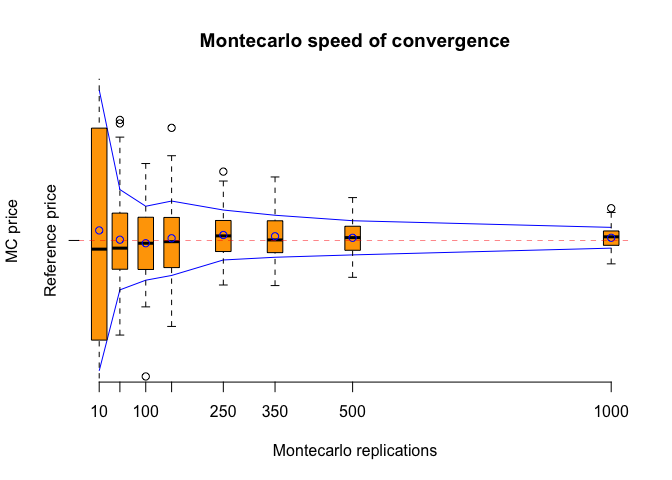
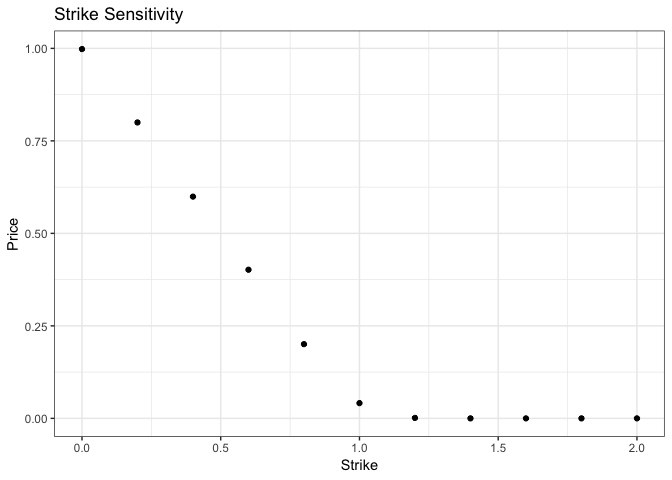
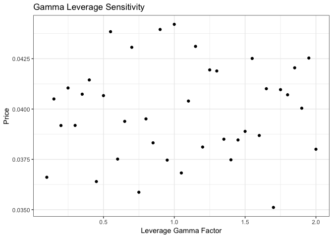
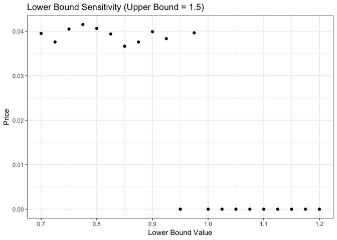
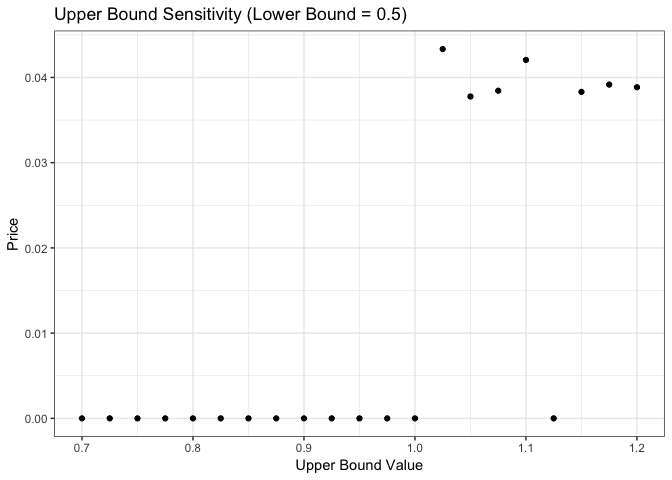

Montecarlo Pricing for Exotic Options
================

The aim of the following code is to price a call option in which the underlying asset follows a Constant Elasticity Variance Process (CEV). Montecarlo simulations are made to simulate the expected and theoretical value of the option. Some conditions that I propose must be cumplimented:

-   There are 3 stages of time for the price of the underlying within the life of the option that must be within an interval, defined by alpha (lower bound) and beta (upper bound).
-   If this condition is fulfilled, the payoff activates for that stage of time, otherwise not. The total payoff will be the expected mean of the payoffs of each stage of time.

The CEV (Constant Elasticity Variance) is a diffusion model, in this case for a stock price *S*, where r is the risk free rate, *d**z* is a wiener process, *σ* is the volatility parameter and *γ* is a positive constant. It takes the form

*d**S**t* = *μ**S**d**t* + *σ**S*<sup>*γ*</sup> + *d**z*

Note that if the gamma is equal to 1, it will take the same form that as a geometric Brownian Motion. Moreover, if the gamma is lower than 1, the volatility increases as the stock price decreases, creating a probability distribution with a heavy left tail. This is due to the fact that when the volatility increases, it makes the stock more likely to go down. In the other hand if gamma is bigger than 1, the the volatility increases as the stock price increases. The CEV model is useful for valuating exotic equity options since the parameters of the model can be chosen to fit the prices of plain vanilla options as closely as possible by minimizing the sum of the squared differences between model prices and market prices.

As we see, we write the model in general form, so we set the values, but recall that this values are set to simulate. A final user should provide the values, therefore the given ones in here are arbitrary: the length of the interval for our data is 100. The starting point is 1. Then the volatility is 1% and mu is 0. We have the boundaries for beta=1.5 and alpha=0.5 as a basis (Since aftwerwards we will perform the sensitive analysis). However we could change this values as we said as they are arbitrary and the final user could use it as he/she wants, for instance to model a in-the-money , at-the-money or an out-the-money option.

Process
=======

``` r
library(ggplot2)
#Clean all
rm(list=ls())

#CEV simulation function
simulate_cev = function (N,T,start,gamma,vol,mu,alpha1,beta1,strike) {
  
  #Definition of T
  T1=round(0.25*T,digits=0)
  T2=round(0.50*T,digits=0)
  T3=round(0.75*T,digits=0)
  
  #Initialization
  dst=matrix(NA,T,1)    
  st=matrix(NA,T+1,1)         
  payoff.st=matrix(NA,4,N) 
  indicator=matrix(NA,3,N) 
  results=matrix(NA,1,N)
  
  st[1,]=start
  deltat=1
  
  error=matrix(rnorm(T*N,mean=0,sd=vol), T, N) 

  #Double loop for simulations and time
  for (j in 1:N) {
  
    for (i in 1:T) {
           
           
           dst[i,1]=mu*st[i,1]*deltat+(st[i,1]^gamma)*error[i,j]*sqrt(deltat)
           st[i+1,1]=st[i,1]+dst[i,1]
           
    }
  
    payoff.st[1,j]=st[T1+1,1]
    payoff.st[2,j]=st[T2+1,1]
    payoff.st[3,j]=st[T3+1,1]
    payoff.st[4,j]=st[T+1,1]

}

  #Activation of payoff
  indicator[1,]=((payoff.st[1,]>=alpha1) && (payoff.st[1,]<=beta1))
  indicator[2,]=((payoff.st[2,]>=alpha1) && (payoff.st[2,]<=beta1))
  indicator[3,]=((payoff.st[3,]>=alpha1) && (payoff.st[3,]<=beta1))
  
  
  #Distribution of payoff
  for (j in 1:N) {
   
    results[1,j]=max(0,payoff.st[4,j]-strike)*indicator[1,j]*indicator[2,j]*indicator[3,j]
    
  }
  
  #Expected value
  exp.value=mean(results[1,])
  theoretical.lower=exp.value-1.96*sd(results[1,])/sqrt(N)
  theoretical.upper=exp.value+1.96*sd(results[1,])/sqrt(N)

  final=list(Expected.Value=exp.value,
             Lower.Bound=theoretical.lower,
             Upper.Bound=theoretical.upper)
  
  return(final)
  
  }
```

MonteCarlo Speed of Convergence
===============================

``` r
#Reference Simulation
benchmark=simulate_cev(N=10000,T=100,start=1,gamma=1,vol=0.01,mu=0,alpha1=0.5,beta1=1.5,strike=1)

m <- c(10, 50, 100, 150, 250, 350, 500, 1000)
p1 <- NULL
err <- NULL
nM <- length(m)
repl <- 100
mat <- matrix(NA, repl, nM)
for (k in 1:nM) {
  tmp <- numeric(repl)
  for (i in 1:repl) {
    tmp[i] <- simulate_cev(N = m[k],T=100,start=1,gamma=1,
                           vol=0.01,mu=0,alpha1=0.5,
                           beta1=1.5,strike=1)$Expected.Value
  }
  mat[, k] <- tmp
  p1 <- c(p1, mean(tmp))
  err <- c(err, sd(tmp))
}
colnames(mat) <- m

minP <- min(p1 - err)
maxP <- max(p1 + err)
```

``` r
plot(m, p1, type = "n", ylim = c(minP, maxP), axes = F, ylab = "MC price", xlab =
       "Montecarlo replications")
lines(m, p1 + err, col = "blue")
lines(m, p1 - err, col = "blue")
axis(2, benchmark$Expected.Value, "Reference price")
axis(1, m)
boxplot(mat, add = TRUE, at = m, boxwex = 30, col = "orange", axes = F)
points(m, p1, col = "blue", lwd = 1, lty = 1)
abline(h = benchmark$Expected.Value, lty = 2, col = "red", lwd = 0.5)
title("Montecarlo speed of convergence")
```



MonteCarlo Empirical Price
==========================

``` r
m <- 1000
nM <- length(m)
repl <- 100
mat <- matrix(NA, repl, nM)
for (k in 1:nM) {
  tmp <- numeric(repl)
  for (i in 1:repl) tmp[i] <- simulate_cev(N = m[k],T=100,start=1,gamma=1,vol=0.01,mu=0,alpha1=0.5,beta1=1.5,strike=1)$Expected.Value
  mat[, k] <- tmp
}

price=mean(tmp)
lower.emp=quantile(mat[,1],0.025)
upper.emp=quantile(mat[,1],0.975)
print(price)
```

    ## [1] 0.04004851

``` r
print(lower.emp)
```

    ##       2.5% 
    ## 0.03713037

``` r
print(upper.emp)
```

    ##      97.5% 
    ## 0.04355607

This is the price for the values set by the final user.

Sensitivity Analaysis
=====================

The sensitivity allows us to know if we did things write. In other words, we check how sensitive is our price when one of the parameters changes, holding the other parameters constant.

Sensitivity on strike
=====================

``` r
strike=seq(from = 0, to = 2, by = 0.2)
sensi_strike=matrix(NA,length(strike),1)

for (i in 1:length(strike)) {
  
  sensi_strike[i]=simulate_cev(N = 5000,T=100,start=1,gamma=1,vol=0.01,mu=0,alpha1=0.5,beta1=1.5,strike=strike[i])$Expected.Value
  
}

ggplot() + geom_point(aes(x=strike, y=sensi_strike)) +
  xlab("Strike") + ylab("Price") + ggtitle("Strike Sensitivity") + theme_bw()
```



Sensitivity on drift
====================

``` r
mu=seq(from = 0, to = 0.01, by = 0.001)
sensi_mu=matrix(NA,length(mu),1)

for (i in 1:length(mu)) {
  
  sensi_mu[i]=simulate_cev(N = 5000,T=100,start=1,gamma=1,vol=0.01,mu=mu[i],alpha1=0.5,beta1=1.5,strike=1)$Expected.Value
  
}

ggplot() + geom_point(aes(x=mu, y=sensi_mu)) +
  xlab("Daily Drift") + ylab("Price") + ggtitle("Drift Sensitivity") + theme_bw()
```


Sensitivity on Time
===================

``` r
#Reduced the gap between alpha1 and beta1 to better see the effect
time=seq(from = 20, to = 400, by = 20)
sensi_time=matrix(NA,length(time),1)

for (i in 1:length(time)) {
  
  sensi_time[i]=simulate_cev(N = 5000,T=time[i],start=1,gamma=1,vol=0.01,mu=0,alpha1=0.95,beta1=1.05,strike=1)$Expected.Value
  
}

ggplot() + geom_point(aes(x=time, y=sensi_time)) +
  xlab("Time horizon") + ylab("Price") + ggtitle("Time Sensitivity") + theme_bw()
```


Sensitivity on volatility
=========================

``` r
volatility=seq(from = 0.005, to = 0.1, by = 0.005)
sensi_volatility=matrix(NA,length(volatility),1)

for (i in 1:length(volatility)) {
  
  sensi_volatility[i]=simulate_cev(N = 5000,T=100,start=1,gamma=1,vol=volatility[i],mu=0,alpha1=0.5,beta1=1.5,strike=1)$Expected.Value
  
}

ggplot() + geom_point(aes(x=volatility, y=sensi_volatility)) +
  xlab("Volatility") + ylab("Price") + ggtitle("Volatility Sensitivity") + theme_bw()
```


Sensitivity on gamma
====================

``` r
gamma=seq(from = 0.1, to = 2, by = 0.05)
sensi_gamma=matrix(NA,length(gamma),1)

for (i in 1:length(gamma)) {
  
  sensi_gamma[i]=simulate_cev(N = 1000,T=100,start=1,gamma=gamma[i],vol=0.01,mu=0,alpha1=0.5,beta1=1.5,strike=1)$Expected.Value
  
}
ggplot() + geom_point(aes(x=gamma, y=sensi_gamma)) +
  xlab("Leverage Gamma Factor") + ylab("Price") + ggtitle("Gamma Leverage Sensitivity") + theme_bw()
```



Sensitivity on alpha1
=====================

``` r
alpha1=seq(from = 0.7, to = 1.2, by = 0.025)
sensi_alpha1=matrix(NA,length(alpha1),1)

for (i in 1:length(alpha1)) {
  
  sensi_alpha1[i]=simulate_cev(N = 1000,T=100,start=1,gamma=1,vol=0.01,mu=0,alpha1=alpha1[i],beta1=1.5,strike=1)$Expected.Value
  
}
ggplot() + geom_point(aes(x=alpha1, y=sensi_alpha1)) +
  xlab("Lower Bound Value") + ylab("Price") + ggtitle("Lower Bound Sensitivity (Upper Bound = 1.5)") + theme_bw()
```



Sensitivity on beta1
====================

``` r
beta1=seq(from = 0.7, to = 1.2, by = 0.025)
sensi_beta1=matrix(NA,length(beta1),1)

for (i in 1:length(beta1)) {
  
  sensi_beta1[i]=simulate_cev(N = 1000,T=100,start=1,gamma=1,vol=0.01,mu=0,alpha1=0.5,beta1=beta1[i],strike=1)$Expected.Value
  
}
ggplot() + geom_point(aes(x=beta1, y=sensi_beta1)) +
  xlab("Upper Bound Value") + ylab("Price") + ggtitle("Upper Bound Sensitivity (Lower Bound = 0.5)") + theme_bw()
```


